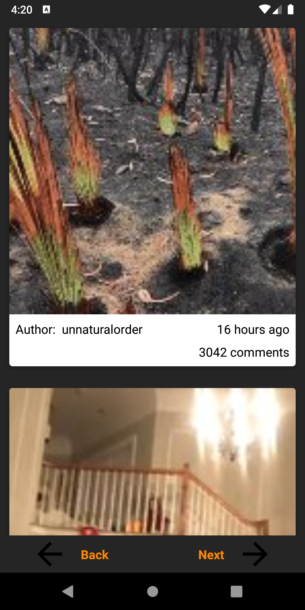

# RedditTopPosts
RedditTopPosts is an open-source app for Android (API level 23+).
## Description
The application uses Reddit API and shows user top posts from Reddit. User can
open posts in fullscreen if it`s available and save post poster into gallery

&nbsp;&nbsp;&nbsp;&nbsp;&nbsp;&nbsp;

